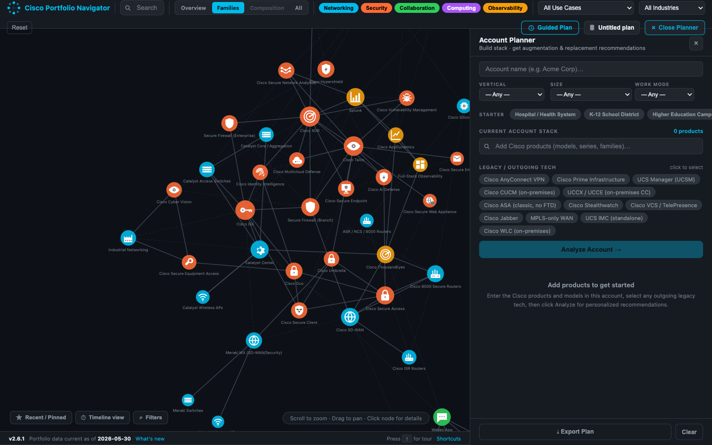

# Portfolio Navigator Plus

<p align="center">
  
</p>

A personal sandbox fork of [Cisco Portfolio Navigator](https://github.com/bnarcum/cisco-portfolio-navigator) for experimenting with enhancements without affecting the production tool.

**Live (this project):** https://bnarcum.github.io/portfolio-navigator-plus/

**Upstream production:** https://bnarcum.github.io/cisco-portfolio-navigator/

## What it does

Same core capabilities as Cisco Portfolio Navigator — guided planning, portfolio graph views, account planner, AI assistant (BYOK), exports, and more. See the [upstream README](https://github.com/bnarcum/cisco-portfolio-navigator) for the full feature list.

## Local development

```bash
cd "/Users/bnarcum/Projects/Portfolio Navigator Plus"
open cisco-portfolio-navigator.html
# or
python3 -m http.server 8765
# → http://localhost:8765/cisco-portfolio-navigator.html
```

Optional tests: `npm install && npm test`

## Git remotes

This repo is **independent** from production. To pull upstream fixes when you choose:

```bash
git remote add upstream https://github.com/bnarcum/cisco-portfolio-navigator.git
git fetch upstream
git merge upstream/main
```

## License

Personal / educational use. Cisco product names, descriptions, and trademarks are property of Cisco Systems, Inc.
